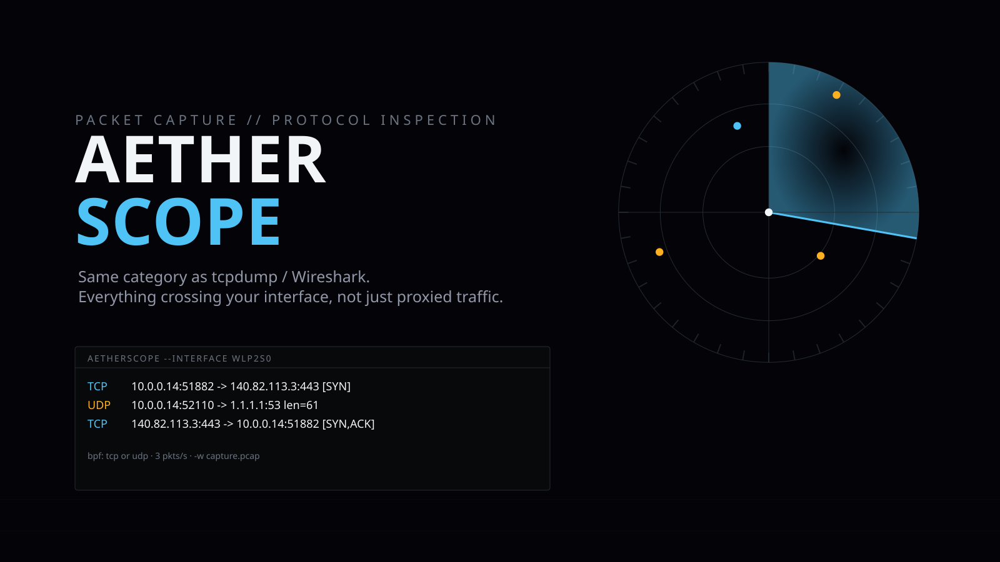

<p align="center">
  
</p>

[](https://github.com/darkstardevx/aetherscope/actions/workflows/ci.yml)
[](https://github.com/darkstardevx/aetherscope/actions/workflows/release.yml)

# 🔭 AetherScope · 🐙 Proteus

`Rust` · `libpcap` · workspace

## 📦 Install

```bash
curl -fsSL https://raw.githubusercontent.com/darkstardevx/aetherscope/main/install.sh | sh
```

Downloads the latest release for your platform (Linux or macOS, x86_64
or aarch64), verifies its SHA-256 checksum, and installs both
`aetherscope` and `proteus` to `~/.local/bin`.

> [!NOTE]
> Like `tcpdump`/Wireshark, these binaries link against the system's
> `libpcap` at runtime — it isn't bundled. The prebuilt Linux binaries
> are built on Ubuntu and need libpcap's legacy `libpcap.so.0.8` name:
> `sudo apt install libpcap0.8` on Debian/Ubuntu. On distros that only
> ship the modern `libpcap.so.1` name (Arch, Fedora, etc.), build from
> source instead (`cargo build --release`) — it links against whatever
> libpcap you actually have. macOS ships libpcap in the base system, no
> action needed. `install.sh` detects this and tells you which case
> you're in.

**Packet capture and protocol inspection on your own interfaces** — the
same category of tool as `tcpdump`/Wireshark. Not a proxy like
[WraithFlow](https://github.com/darkstardevx/wraithflow) — that only sees
traffic explicitly routed through one of its pipelines. This sits directly
on a network interface and sees everything crossing it: UDP, ICMP, ARP,
any TCP connection, not just the ones you've deliberately proxied.

**Scope, on purpose:** general packet/protocol capture on an interface you
own. **Not** an 802.11 monitor-mode wireless sniffer — that's a different,
meaningfully more sensitive category (capturing *other devices'* ambient
wireless traffic, not just your own machine's). This tool only ever sees
traffic on an interface this machine itself is a party to, same as
`tcpdump` would.

This is a small workspace, not a single crate:

| Crate | What it is |
|---|---|
| `aetherscope-core` | Shared library — capture (live + offline `.pcap`), protocol parsing, rendering, TCP stream grouping. Neither binary below has its own copy of any of this. |
| `aetherscope` | The original scriptable CLI — capture, filter, render, exit. Unchanged behavior, now also supports `-w` pcap export. |
| **`proteus`** | **New** — a Wireshark-style interactive TUI: live capture or load a `.pcap`, browse/filter packets, **Follow TCP Stream**, export/import real `.pcap` files. |

## 🚀 AetherScope (CLI)

- Captures on a named interface via `libpcap` (the `pcap` crate) — the exact same capture engine `tcpdump`/Wireshark use
- **BPF filter syntax** — the same filter language as `tcpdump` (`tcp port 22`, `host 192.168.1.5`, `udp and not port 53`), for free from libpcap, not reimplemented
- Three output formats: `summary` (one line, tcpdump-style), `hexdump`, `json`
- `-w <file.pcap>` — also write every captured frame to a real, Wireshark-compatible pcap file alongside the terminal output
- Colors sourced from the shared `cybercore` CYBERGRID palette (by protocol) — same convention as WraithFlow

```bash
cargo build --release
aetherscope --list-interfaces
sudo aetherscope --interface wlp2s0
sudo aetherscope --interface lo --filter "tcp port 8765" --format json --pretty
sudo aetherscope --interface wlp2s0 -w capture.pcap
```

Needs root or `CAP_NET_RAW` to actually open a capture device — everything
else (`--list-interfaces`) works unprivileged.

> [!NOTE]
> `sudo` resets `PATH` by default (`secure_path` in `/etc/sudoers`),
> which usually doesn't include `~/.local/bin` — so a bare `sudo
> aetherscope`/`sudo proteus` can fail with "command not found" even
> though the binary works fine on your own PATH. If that happens, either
> use the full path (`sudo /home/raven/.cargo-target/release/proteus ...`)
> or preserve your PATH for that one call: `sudo env "PATH=$PATH"
> proteus ...`.

## 🐙 Proteus (TUI)

The interactive browser AetherScope never had — `wf-tui`-style live
capture, but for packets instead of proxy stats, plus the two things
people usually reach for a separate tool for:

- **Follow TCP Stream** (`s` on a selected TCP packet) — reconstructs the
  full conversation (both directions, color-coded), the actual headline
  feature this was built for.
- **pcap export/import** (`w` in the TUI, or `--write`/`-r` on the command
  line) — real `.pcap` files, verified against real `tshark` reading
  Proteus's own exports and vice versa, not just round-tripped through
  itself.

```bash
proteus --list-interfaces          # no root needed
sudo proteus -i wlp2s0             # live capture (needs root/CAP_NET_RAW)
proteus -r some-capture.pcap       # offline analysis — no root needed at all
proteus -r capture.pcap --list     # plain-text dump, no TUI (scripting)
proteus -r capture.pcap --write out.pcap   # batch re-export, no TUI
```

Keys: `j/k` move, `/` filter (src/dst/protocol/info substring), `enter`/
`l` full packet detail (headers + hexdump), `s` Follow TCP Stream, `w`
export to `.pcap`, `f` toggle follow-live/browse-history during a live
capture, `?` help, `q` quit.

## 🧩 Layout

```
aetherscope-core/src/capture.rs   live + offline (.pcap) capture, pcap export/import
aetherscope-core/src/packet.rs    Ethernet/IPv4/IPv6/TCP/UDP/ICMP parsing, unit-tested
aetherscope-core/src/stream.rs    TCP stream grouping (StreamKey) for Follow TCP Stream
aetherscope-core/src/format.rs    summary/hexdump/json rendering, cybercore color wiring
aetherscope/src/main.rs           the CLI
proteus/src/{main,app,ui,theme}.rs   the TUI
```

## 🗺 Roadmap / known limitations

- [x] Ethernet/IPv4/IPv6/TCP/UDP/ICMP parsing, unit-tested
- [x] BPF filtering via libpcap
- [x] summary/hexdump/json output, cybercore-themed colors
- [x] pcap file export/import, verified against real `tshark`
- [x] Follow TCP Stream, verified against a real capture `tshark` also parses identically
- [ ] IPv6 extension header handling (currently reads "next header" directly, doesn't walk extension header chains)
- [ ] Higher-level protocol dissection (HTTP, DNS, TLS ClientHello, etc.) — currently stops at the transport-layer header
- [ ] Real TCP-sequence-number-aware stream reassembly — Follow TCP Stream orders by capture timestamp per direction today, not gap/retransmit-aware reassembly (genuine TCP-stack complexity, out of scope for now)

## 📄 License

MIT
